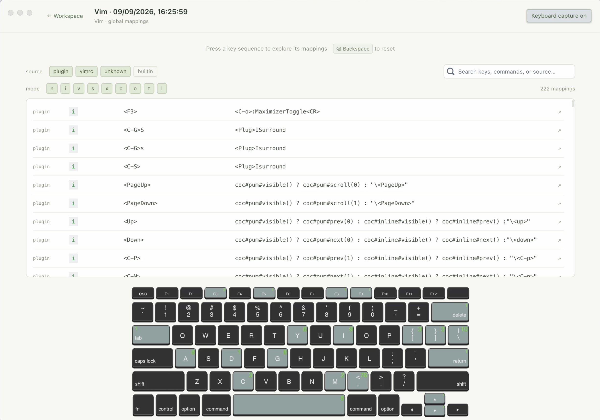

# keycraft



A macOS app for reviewing and exploring Vim and tmux shortcuts.

- Import Vim mappings from your vimrc and plugins.
- Import tmux key tables and both prefix keys.
- Paste mappings or load an exported text file.
- Explore key sequences on the keyboard and filter mappings by mode, table, source, or command.
- Save imports as snapshots to revisit and compare your setups.
- Browse the Vim 9.0 reference with 737 entries.

## Use it

Open **keycraft.app** and click **Import from Vim**, **Import from tmux**, or **Import text or file**. Each import creates a new snapshot.

Choose **All snapshots**, **Vim**, or **tmux** in the sidebar. Use **Filter snapshots** to find a setup, then open it to explore its mappings.

Type a key sequence to narrow the results. For tmux's `prefix` table, enter your prefix first, release it, then type the command key. For copy-mode bindings, select their table and type the binding itself. Click a mapping to inspect its command and source.

Vim imports record your configured leader key and highlight it in gold on the keyboard. After entering the leader, continue typing to explore its mappings; Backspace resets the sequence. Text imports have an optional **Leader key** field. For older snapshots, use **Set leader** in the explorer; **Edit leader** updates the saved highlight without changing your Vim configuration or mappings. Use a character such as `,` or notation such as `<Space>` or `<C-a>`.

Press **Backspace** or click **Clear sequence** to reset the sequence. Text fields keep their usual editing behavior. Enter and Escape can be reviewed as bindings; turn off keyboard capture to use normal keyboard navigation. macOS may intercept reserved shortcuts before the app receives them.

Use the trash button beside a snapshot to delete it, or **Clear all snapshots** below the list to remove the entire library, including snapshots hidden by filters. Both actions require confirmation. Deleting snapshots keeps your Vim and tmux configuration and the bundled reference intact.

## Import details

Vim import starts Vim with your vimrc and plugins, so their startup behavior applies. It captures global mappings available at startup. To include buffer-local or filetype-specific mappings from an editing session, export from the relevant Vim buffer and import the text.

For Vim text imports, use `:verbose map` and `:verbose map!` output. For tmux, use `tmux list-keys` output and enter your `prefix` and `prefix2` values in the import dialog. **Import from tmux** reads these values automatically. For a custom tmux socket, paste the output of `tmux -L <name> list-keys`.

The bundled reference describes Vim 9.0 and may differ from newer versions.

## Build and run

Requirements: macOS, Node.js 22.12 or newer, npm, and Yarn Classic. Vim imports require Vim; tmux imports require tmux and a running session.

```sh
yarn --cwd keycraft install --frozen-lockfile --ignore-optional
npm --prefix desktop ci
npm run desktop
```

Dependency installation and packaging may download the Electron runtime. Optional native dependencies are skipped during UI installation.

To build the app:

```sh
npm run package:mac
```

The output is `dist/desktop/keycraft-darwin-arm64/keycraft.app` on Apple Silicon, or `darwin-x64` on an Intel Mac. Open it directly or copy it to Applications. Node.js is only needed to build it.

To build a DMG installer after installing the dependencies above:

```sh
make dmg
```

This rebuilds the app and creates `dist/desktop/keycraft-macos-arm64.dmg` on Apple Silicon, or `keycraft-macos-x64.dmg` on Intel. The architecture follows the Node.js process, including when running under Rosetta. Open the DMG and drag **keycraft.app** into **Applications** to install it.

The script includes the app's license files, verifies the disk image, and cleans up temporary files. A previous DMG is replaced only after a successful build. You can also run `./scripts/build-dmg.sh` directly.

The packaging script currently uses an ad-hoc signature. Public distribution requires Developer ID signing and notarization.

## Automated tests and builds

The [Test and build workflow](.github/workflows/ci.yml) runs on pushes and pull requests, and can be started manually from GitHub's **Actions** tab. It uses Node.js 24 and builds Apple Silicon (`arm64`) and Intel (`x64`) versions on separate macOS runners.

Each build runs `npm test`, packages the app, runs the packaged app integration tests, and verifies the app signature. Successful builds upload `keycraft-macos-arm64` and `keycraft-macos-x64` artifacts, each containing a ZIP and SHA-256 checksum. Download them from the workflow run's **Artifacts** section within 14 days. Test screenshots are retained for 7 days, including screenshots available from failed runs.

The ZIP preserves the app's executable permissions and framework symlinks and includes its license files. CI builds use the same ad-hoc signing as the packaging script and require no signing secrets. The workflow does not publish GitHub Releases.

## Development

```sh
npm run dev:ui    # Preview the React interface on port 3090
npm run build:ui  # Build the app interface
npm test          # Parsing, keyboard matching, UI flows, and storage
npm --prefix desktop run test:app # Test the packaged app
```

The UI preview supports text imports and stores preview snapshots in browser localStorage, separately from the app workspace. Use `npm run desktop` to test Vim and tmux process imports.

The packaged app test uses a temporary vimrc and isolated workspace. It checks imports, keyboard capture, tmux prefixes, window layout, filtering, dialogs, and persistence after adding or deleting snapshots. Screenshots are written to `dist/desktop/screenshots/`.

- `desktop/`: Electron window, import bridge, workspace storage, and packaging.
- `keycraft/`: React interface and keyboard visualization.
- `data/builtin_mappings.csv`: Vim reference data. Run `python3 scripts/bundle-builtin.py` to regenerate the bundled JSON after editing it.

Workspace data is stored in `~/Library/Application Support/keycraft/workspace.json`.

The Electron renderer uses context isolation and a sandbox. The import bridge exposes fixed Vim and tmux operations.
